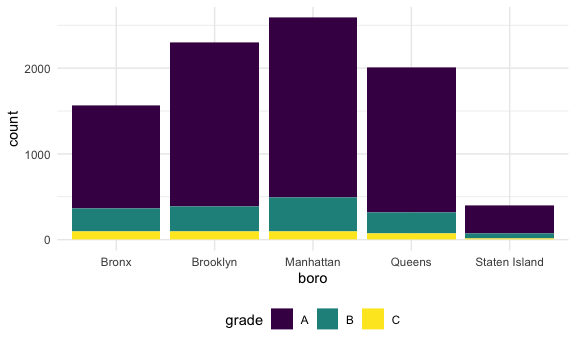
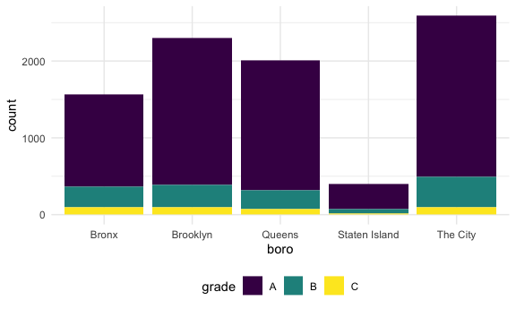
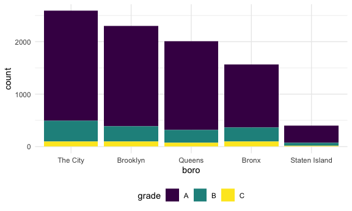

Strings and factors
================
2025-10-09

Load important packages

``` r
library(rvest)
```

    ## 
    ## Attaching package: 'rvest'

    ## The following object is masked from 'package:readr':
    ## 
    ##     guess_encoding

``` r
library(p8105.datasets)
```

## Mostly use string vectors

``` r
string_vector = c("my", "name", "is", "jeff")

str_detect(string_vector, "jeff")
```

    ## [1] FALSE FALSE FALSE  TRUE

``` r
str_detect(string_vector, "Jeff") # case sensitive
```

    ## [1] FALSE FALSE FALSE FALSE

``` r
str_detect(string_vector, "e")
```

    ## [1] FALSE  TRUE FALSE  TRUE

``` r
str_replace(string_vector, "jeff", "Jeff")
```

    ## [1] "my"   "name" "is"   "Jeff"

``` r
str_replace(string_vector, "e", "E")
```

    ## [1] "my"   "namE" "is"   "jEff"

``` r
str_replace(string_vector, "e", "")
```

    ## [1] "my"  "nam" "is"  "jff"

``` r
str_remove(string_vector, "e")
```

    ## [1] "my"  "nam" "is"  "jff"

copied(from p8105.com)

``` r
string_vec = c(
  "i think we all rule for participating",
  "i think i have been caught",
  "i think this will be quite fun actually",
  "it will be fun, i think"
  )

str_detect(string_vec, "i think")
```

    ## [1] TRUE TRUE TRUE TRUE

``` r
str_detect(string_vec, "^i think") # find at the start of string
```

    ## [1]  TRUE  TRUE  TRUE FALSE

``` r
str_detect(string_vec, "i think$") # find at the end of string
```

    ## [1] FALSE FALSE FALSE  TRUE

``` r
str_remove(string_vec, "i think$")
```

    ## [1] "i think we all rule for participating"  
    ## [2] "i think i have been caught"             
    ## [3] "i think this will be quite fun actually"
    ## [4] "it will be fun, "

Pumpkin themed example

``` r
string_vec = c(
  "Time for a Pumpkin Spice Latte!",
  "went to the #pumpkinpatch last weekend",
  "Pumpkin Pie is obviously the best pie",
  "SMASHING PUMPKINS -- LIVE IN CONCERT!!"
  )

str_detect(string_vec, "pumpkin")
```

    ## [1] FALSE  TRUE FALSE FALSE

``` r
str_detect(string_vec, "Pumpkin")
```

    ## [1]  TRUE FALSE  TRUE FALSE

``` r
str_detect(string_vec, "[Pp]umpkin") # everything in the bracket is what we want
```

    ## [1]  TRUE  TRUE  TRUE FALSE

Let’s more complicated:

``` r
string_vec = c(
  '7th inning stretch',
  '1st half soon to begin. Texas won the toss.',
  'she is 5 feet 4 inches tall',
  '3AM - cant sleep :('
  )

str_detect(string_vec, "[0-9]")
```

    ## [1] TRUE TRUE TRUE TRUE

``` r
str_detect(string_vec, "[0-9][A-Z]")
```

    ## [1] FALSE FALSE FALSE  TRUE

``` r
str_detect(string_vec, "[0-9][a-zA-Z]")
```

    ## [1]  TRUE  TRUE FALSE  TRUE

``` r
string_vec = c(
  'Its 7:11 in the evening',
  'want to go to 7-11?',
  'my flight is AA711',
  'NetBios: scanning ip 203.167.114.66'
  )

str_detect(string_vec, "7.1") # . means everything
```

    ## [1] TRUE TRUE TRUE TRUE

``` r
str_detect(string_vec, "7\\.1") # find special characters
```

    ## [1] FALSE FALSE FALSE  TRUE

## Factors

``` r
vec_sex = factor(c("male", "male", "female", "female")) # alphabetical order
vec_sex
```

    ## [1] male   male   female female
    ## Levels: female male

``` r
as.numeric(vec_sex)
```

    ## [1] 2 2 1 1

``` r
vec_sex = fct_inorder(vec_sex) # what comes first is first
vec_sex
```

    ## [1] male   male   female female
    ## Levels: male female

## Revisit NDSUH

Import NDSUH data from the web

``` r
nsduh_url = "http://samhda.s3-us-gov-west-1.amazonaws.com/s3fs-public/field-uploads/2k15StateFiles/NSDUHsaeShortTermCHG2015.htm"

drug_use_html = read_html(nsduh_url)
```

This is an easy case

``` r
ndsuh_df = 
  drug_use_html |> 
  html_table() |> 
  first() |> 
  slice(-1)
```

Now do the tidying…

``` r
marj_df = 
  ndsuh_df |> 
  select(-contains("P Value")) |> 
  pivot_longer(
    -State,
    names_to = "age_year",
    values_to = "percent"
  ) |> 
  separate(age_year, into = c("age", "year"), sep = "\\(") |> 
  mutate(
    year = str_remove(year, "\\)"),
    percent = str_remove(percent, "[a-c]$"),
    percent = as.numeric(percent)
  ) |> 
  filter(
    !(State %in% c("Total U.S.", "Northeast", "Midwest", "South", "West"))
  )
```

Let’s make a plot:

``` r
marj_df |> 
  filter(age == "12-17") |> 
  mutate(State = fct_reorder(State, percent)) |> 
  ggplot(aes(x = State, y = percent, color = year)) +
  geom_point() +
  theme(axis.text.x = element_text(angle = 45, hjust = 1))
```


## Restaurant inspections

``` r
data("rest_inspec")
```

``` r
rest_inspec |> 
  group_by(boro, grade) |> 
  summarize(n = n()) |> 
  pivot_wider(
    names_from = grade,
    values_from = n
  )
```

    ## `summarise()` has grouped output by 'boro'. You can override using the
    ## `.groups` argument.

    ## # A tibble: 6 × 9
    ## # Groups:   boro [6]
    ##   boro              A     B     C  `NA`     N     P     Z     G
    ##   <chr>         <int> <int> <int> <int> <int> <int> <int> <int>
    ## 1 0                33     9     6    67    NA    NA    NA    NA
    ## 2 Bronx         14071  2611   976 17190   161   236   605    NA
    ## 3 Brooklyn      38896  6423  2194 49825   345   782  1168     2
    ## 4 Manhattan     61675  9107  3600 76581   591   924  1816     3
    ## 5 Queens        36258  5526  1996 44136   350   604  1287    NA
    ## 6 Staten Island  5410   855   248  6315    71    61   116    NA

Update the dataset

``` r
rest_inspec =
  rest_inspec|> 
  filter(grade %in% c("A", "B", "C"), boro != 0)
```

Look for pizza places:

``` r
rest_inspec |> 
  filter(str_detect(dba, "Pizza")) |> 
  group_by(boro, grade) |> 
  summarize(n = n()) |> 
  pivot_wider(
    names_from = grade,
    values_from = n
  )
```

    ## `summarise()` has grouped output by 'boro'. You can override using the
    ## `.groups` argument.

    ## # A tibble: 4 × 3
    ## # Groups:   boro [4]
    ##   boro          A     B
    ##   <chr>     <int> <int>
    ## 1 Bronx        15     3
    ## 2 Brooklyn     15    NA
    ## 3 Manhattan    13     3
    ## 4 Queens       11     4

``` r
rest_inspec |> 
  filter(str_detect(dba, "[Pp][Ii][Zz][Zz][Aa]")) |> 
  group_by(boro, grade) |> 
  summarize(n = n()) |> 
  pivot_wider(
    names_from = grade,
    values_from = n
  )
```

    ## `summarise()` has grouped output by 'boro'. You can override using the
    ## `.groups` argument.

    ## # A tibble: 5 × 4
    ## # Groups:   boro [5]
    ##   boro              A     B     C
    ##   <chr>         <int> <int> <int>
    ## 1 Bronx          1201   261    98
    ## 2 Brooklyn       1919   291    95
    ## 3 Manhattan      2091   400    96
    ## 4 Queens         1695   239    78
    ## 5 Staten Island   328    60    15

Let’s make a plot:

``` r
rest_inspec |> 
  filter(str_detect(dba, "[Pp][Ii][Zz][Zz][Aa]")) |> 
  ggplot(aes(x = boro, fill = grade)) + 
  geom_bar()
```



This does not work as intended:

``` r
rest_inspec |> 
  filter(str_detect(dba, "[Pp][Ii][Zz][Zz][Aa]")) |> 
  mutate(boro = fct_infreq(boro),
         boro = str_replace(boro, "Manhattan", "The City")) |> # goes back to alphabetic order
  ggplot(aes(x = boro, fill = grade)) + 
  geom_bar()
```



This works:

``` r
rest_inspec |> 
  filter(str_detect(dba, "[Pp][Ii][Zz][Zz][Aa]")) |> 
  mutate(boro = fct_infreq(boro),
         boro = fct_recode(boro, "The City" ="Manhattan")) |> # Still remains the order, only change label
  ggplot(aes(x = boro, fill = grade)) + 
  geom_bar()
```


